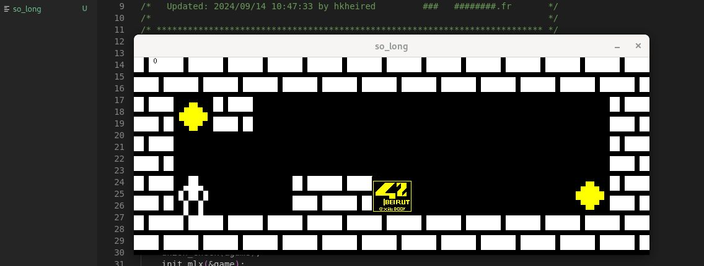

# 🎮 MazeRunner Game




## 📘 Project Overview

`MazeRunner game` is a simple 2D game project developed in C using the **MiniLibX** graphics library. The goal is to build a basic graphical game where the player navigates through a map, collects all items, and reaches the exit — all while following strict constraints on asset handling and map design.

## 🏁 Objective

- Load and render a 2D map from a `.ber` file
- Allow player movement using keyboard input
- Collect all collectibles before reaching the exit
- Validate the map: closed walls, valid paths, proper element counts
- Handle game exit events (e.g., window close)

## 📚 Key Concepts

- 2D graphics rendering with **MiniLibX**
- Keyboard event handling in C
- Map parsing and validation
- Pathfinding (e.g., flood fill for reachability)
- Memory management and leak prevention
- Game loop logic and sprite handling

## 🛠️ Technologies

- Language: C
- Graphics: MiniLibX (42's custom lightweight graphics library)
- Compilation: Makefile
- Tools: Valgrind, custom map testers

 # Flood Fill Algorithm
  fills all connected cells of the same color starting from a given point, like the paint bucket tool. It replaces the target color with a new one using DFS or BFS.
## 🗺️ Map Example

```plaintext
11111
1P0C1
10001
1E001
11111

    1 – Wall

    0 – Empty space

    P – Player start

    C – Collectible

    E – Exit

🧠 Game Mechanics

    The player can move up, down, left, or right.

    Each move is counted and displayed.

    The game ends when all collectibles are gathered and the player reaches the exit.

    The map must be rectangular, enclosed by walls, and have at least one player, one exit, and one collectible.

```
To ensure the map is valid, the project often uses a flood fill algorithm to simulate whether the player can reach all collectibles and the exit from the starting position. This ensures playability and enforces map integrity